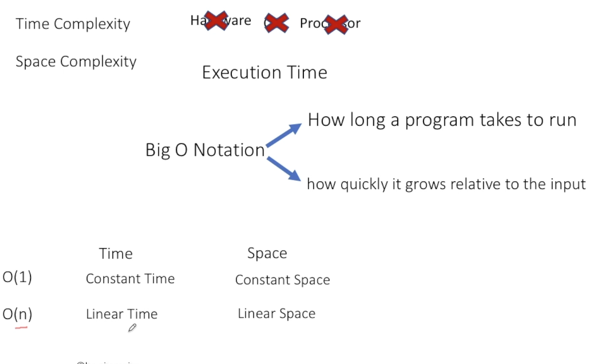
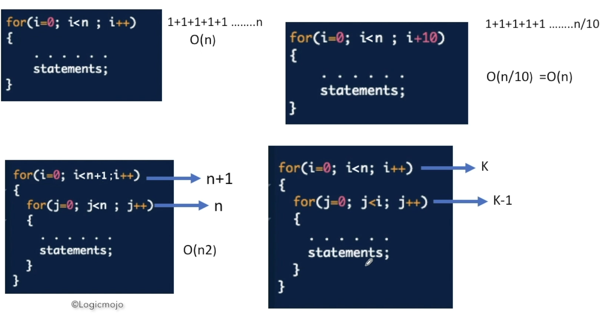
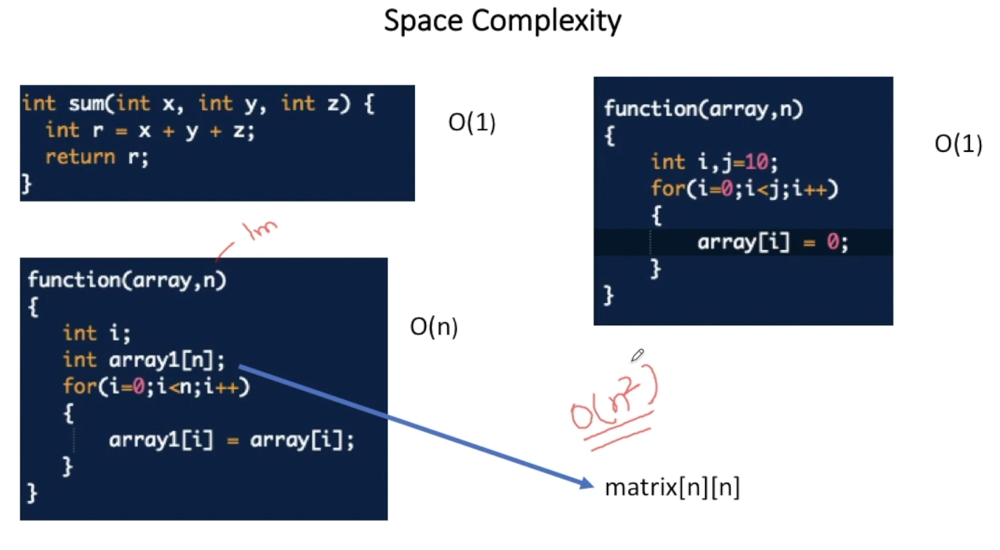

# **Debugging**

---

#### 4 Steps to debug 

🛑 NO READING

🪲 Dry Run (Logic is correct or not)

```kotlin
If(Logic correct) {
  🐛 Check constraints // TLE
  🐛 Print statements
  🐛 Test against custom input aka Logic func()
  🐛 Stub the func/code
  🐛 Comment // Segmentation faults
} else { Correct the Logic }
```

# **Complexity**

---



> **How many time the *statement*** will execute inside a block of code





> #### Determine TC from the Constraints
>
> - **10^8 / sec** means that code should not cross this lakshman rekha
> - Looking at the TC we can determine what approach to use
>
> | Constraints |  TC   |
> | :---------: | :---: |
> |    10^18    | logN  |
> |    10^8     |   N   |
> |    10^4     |  N^2  |
> |    10^6     | NlogN |
> |     500     |  N^3  |
> |    85-90    |  N^4  |
> |     20      |  2^N  |
> |     11      |  N!   |
