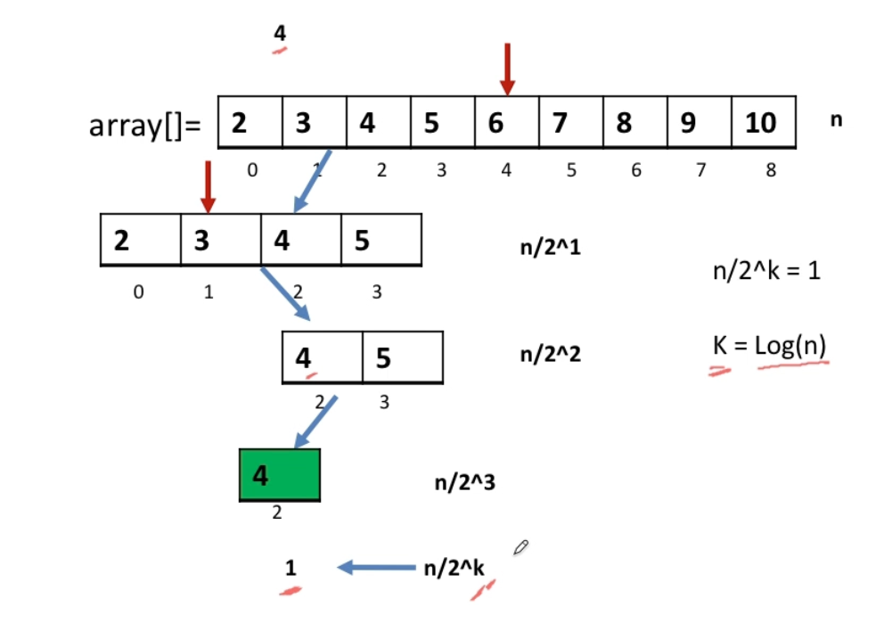

# **Arrays**

---

## Searching & Sorting Algos

#### Searching

- **Manual** - O(N)

- **Binary Search Algo** - O(LogN)

  > If Array is *Sorted ⧡ 𝆓*
  >
  > if Array is *Increasing and Decreasing* ⬆️ ⬇️
  >
  > If *Sorted Arrays is Rotated ℺* 
  >
  > If Array is in *ZigZaw ↯* Format 
  >
  > 

#### Sorting

- **Merge Sort** - O(NLogN) always

  > *Divide and Concur*
  >
  > -- Divide takes O(LogN)
  >
  > -- Merge takes O(N)
  
- **Quick Sort** - O(NLogN) random / middle pivot ; O(N*N) sorted

  > *Divide and Concur*
  >
  > -- Partition
  >
  > -- 

- **Counting Sort** - O(N+N)

  > Keeps counting the occurences in First traversal  // O(N)
  >
  > Update according to occurences in the Second traversal // O(N)

  

# **Problems**

---

#### find Max sum sub array

> - Brute force
>
>   > O(N3) - Find all sub arrays and calculate sum
>   >
>   > O(N2) - Find all sub arrays and while finding keep updating sum
>
> - Divide and Conquer
>
>   > O(NLogN) - Find Left MSS, Find Right MSS, Max of (LeftMSS+RightMSS, LeftSum+RightSum)
>
> - Kadane's Algo
>
>   > 

#### Stock Buy sell

> - Find *Local minima & Local maxima* , Calculate the diff and add to profit
> - *Local Minima -* If next element is greater
> - *Local Maxima* - If next element is smaller

#### Data Structure that supports the followings

> Insert, Delete -> HashMap
>
> Random, find middle, Delete middle -> ArrayList, Doubly LL
>
> *Hashmap key is data and value is index*
>
> Combine them and do pay attention on delete in which we need to update both of them (Swap and index update)

#### Celebrity Problem

> Celebrity knows NO ONE
>
> Celebrity known by EVERYONE
>
> While(X < Y) { // Have processed all candidates 
>
> if (X know Y) // X can't be a celebrity
>
> else // Y can't be a celebrity cz everyone knows it
>
> }
>
> candidate = X;
>
> if X column (except itself) should be 1 (Known by everyone) OR X row (except itself) should be 0 (Knows no one) // So it is indeed a celebrity

#### Sub array(s) of sum 0

> - Sub array mtlb O(N2) s to mil hi jayega
>
> - To make it O(N) use extra space
>
>   Keep adding sum and storing it with the index in MAP<int, List<Int>>
>
>   if at any given point the key exists already in map then pichle index s curr tak sum has to be zero and hence this is a sub array

#### N non repeating elements in Array

> - Using nested loops
>
> - Using extra space like map
>
> - Xoring techniq - https://www.youtube.com/watch?v=bTauscvOymA
>
>   > A ^ A = 0
>   >
>   > A ^ B = K
>   >
>   > A ^ 0 = A

#### Square Root of an element

> - Say find sqrt of 75
>
>   > Make an array from 0 to 75
>   >
>   > Sorted so Binary search
>   >
>   > Keep checking *mid*mid* and discarding the either

#### Segregation of Ks, Ls, Ms

> - Counting Sort aka keep counting and update accordingly in Second traversal
> - Two pointer approach aka Low, Mid, High and keep comparing and swapping Mid

#### Move all the Ks to end while maintain order

> - Two pinter approach
> - Lastly update the pointer till n with Ks

#### In place Matrix Rotation

> - To be a inplace solution matrix has to be a SQUARE matrix otherwise won't possible
> - Transpose O(N2) and reverse the row elements using two pointer and swap approach O(N2) // O(N2) + O(N2)
> - Layer by Layer approach // O(N2)

#### Sorted Matrix find a No

> - Brute force solution is preety simple
> - O(NLogN) solution where we start at the corner and compare. If less then do BINARY SEARCH in that column
> - O(N) solution where we keep on discarding row and columns depending upon the LESS then or GREATER then the value we need to found

#### Jump Game

> - Start with both(j = i = 0) zero and *carry jump* from a[0]
> - Keep reducing both i-- and j-- and when i is out of jump *carry from j*
> - If while jumping you encounter a no which is greater than j then preserve it as it will help in later jumps

#### Remove Duplicates from sorted Array

> - Initilize both i and j and keep incrementing j and i
> - if  (i == i+1) don't increment i BUT keep incrementing j
> - when j finds a new element move it to the position of i+1 while increamenting i
> - The last position of i will give the sorted count and rest all from i+1 till n shall be marked 0

#### Remove duplicate letters from String

> - For Loop and Hashmat // O(N) & O(N)
> - Array of 0..256 and mark value -1 or /0 (null) and finally string.replaceAll("/0", "")

#### Sorted 2D array, Find Max 1's

> 

#### Trapping Rain Water

> - Store the highest bar on Max Left & Right
> - Water can be trapped *at most the level of lesser* otherwise Spill over
> - But there may/may not be the building present already so that height can't store water and hence subtract

#### Count inversions in Array

> Basically we have to compute how many arr[i(left)] > arr[j(right)]
>
> - Merge sort Implementation with some modifications in merge method

#### Rectangle Overlap

> - Compare coordinates of either by forming Symetry
> - Deduce relation b/w coordinates of each other in cartesian plane

#### Next greater No

> 

#### Befores are smaller and afters are greater

> - Befores must be smaller so find and store the MAX at the left of each element
> - Afters must be greater so find and store the MIN at the righ of each element
> - Compare and resolve

#### Quickselect

> 