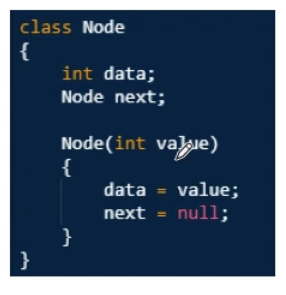
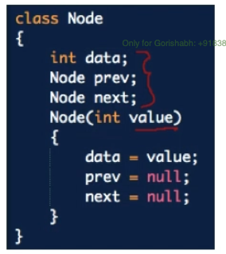

# **Linked Lists**

---

#### Single LL

#### Doubly LL

> 🔴 Handle **head** case accordingly
>
> 🔴 Delete operations on both the lists
>
> 🔴 Selection of pointers aka **head, curr, prev**

# **Problems**

---

#### Reverse K LL

> 

#### Clone a LL

> 

#### Add two numbers as List

> https://www.youtube.com/watch?v=LBVsXSMOIk4
>
> 

#### Flatten the LL

> - Recursion with merge sorting

#### Rearrange a LL

> - using Recursion and two pointers head & last
> - using iteration
>   - Find Middle
>   - Reverse Right half
>   - Start merging

#### Find Intersection

> - Get lengths of both the lists
> - step up the smaller till diff
> - start comparing the head.data
> - If remove cycle and set NULL then previous

#### Segraegate with Even and Odd order

> - Track even pointers and odd pointers
> - Keep modifying the links as per the curr element

#### Find Nth Node from the end of LL / Remove Nth Node from end

> https://afteracademy.com/problems/remove-nth-node-from-list-end
>
> - Recursion / iteration (steps count) for finding
> - For removing only iterative approach

#### Find Middle of a LL

> - O(N) + O(N/2) approach
> - Tortoise approach (**Slow** steps once and **Fast** steps twice)

#### Reverse a LL

> - Save the Link before break (**temp**)
> - **prv** and **curr** will keep the refs and will update accordingly
> - Recursive approach - https://www.youtube.com/watch?v=KYH83T4q6Vs&list=PL2_aWCzGMAwI3W_JlcBbtYTwiQSsOTa6P&index=11

#### Sort a LL using merge sort

> - The recursion will keep dividing the LL into two halves until we reach a single node
> - **first** pointer & **middle** pointer and finally **second** pointer = middle.next
> - Below logic for merging

#### Merge two sorted LL

> https://afteracademy.com/problems/merge-two-sorted-lists
>
> - Always handle edge cases first
> - Init **head** and **temp** for new list creation and return **head**
> - The one that is smaller while first and second are not NULL the temp.next will always point to that node while updating the *respective pointers*

#### Check if LL is Palindrome

> https://afteracademy.com/problems/check-if-a-singly-linked-list-is-palindrome
>
> - Doubly LL is very easy with two pointer approach
> - Singley LL **reverse the right half** then **start comapring with the above appraoch**
> - Now, For **finding middle of a LL**