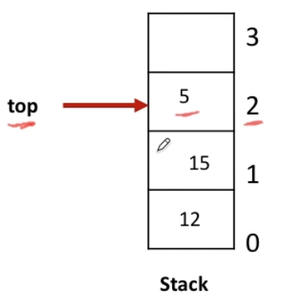

# **Stack**

**LIFO**

---

#### Insert the value in the stack (Push)

#### Delete the *latest* value in the stack (Pop)

#### Keep track of the Latest value Index (Top)

# **Queue**

**FIFO**

---

#### Keep track of the Latest value Index at front (Front)

#### Insert the value in the queue (enqueue)

#### Delete the *latest* value in the queue (dequeue)

#### Keep track of the Latest value Index at last (Rear)

## Circular Queue

---

