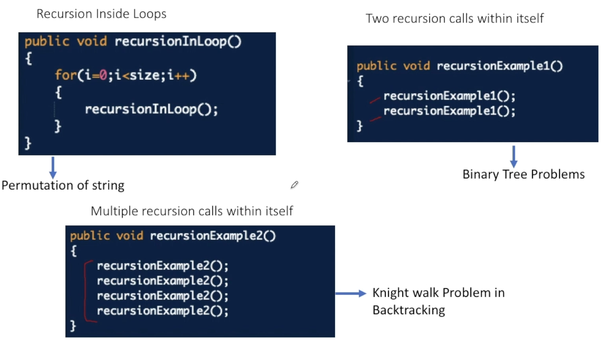

# **Backtracking**

👁 **Permutations / Recursive call inside a loop**

---

> *Backtracking as the name itself says BACK the TRACKING aka We take some steps and then we realize that we took the wrong steps so we UNDO our last steps and find the correct steps*

## Recursion

#### When function calls itself directly or indirectly and it *always have a base condition to break the recursive chain*



## 😱 (n-- 👇🏽)

```java
public static int fact(int n) {
        System.out.println("n is: " + n);
        if(n==1) return 1;
				return n*fact(n--); // Special case for post increment/decrement where it will not change if applied to same variable - https://www.geeksforgeeks.org/pre-increment-and-post-increment-in-c/
    }
```

# **Problems**

---

#### Combination of Parantheses

> - Open and Close ka count maintain
> - base condition is when open and close becomes zero
> - Open ki choice to hamesha hi hogi
> - Close ki choice yogi jab Open ka count will become less

#### Print all permutations of given strings

> - 
