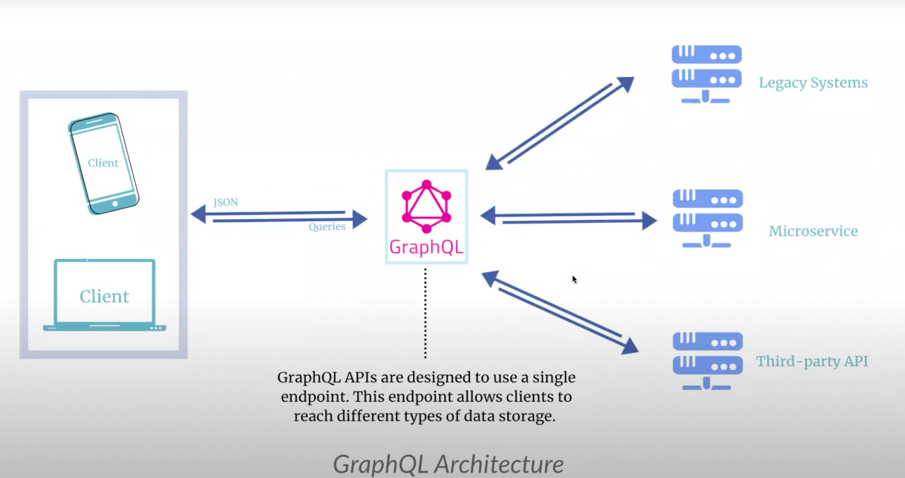
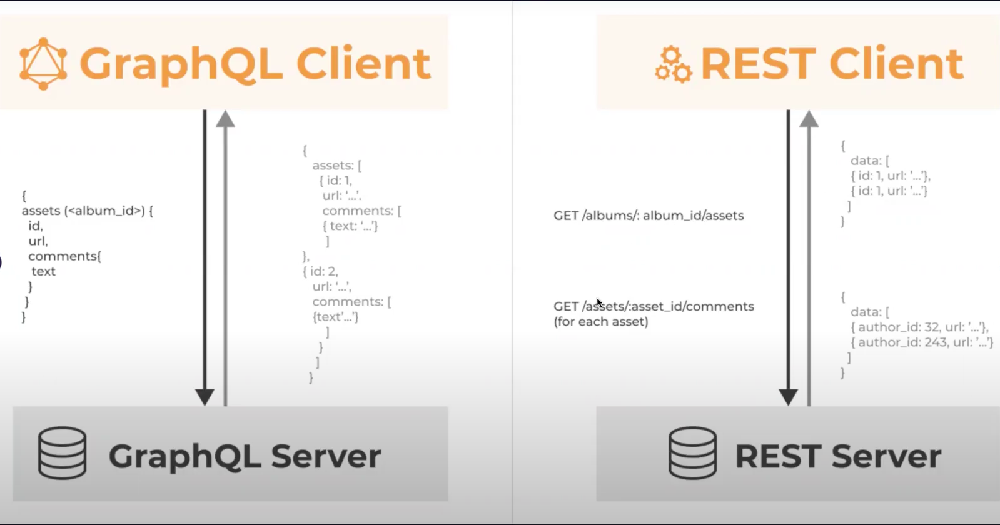

# **GraphQL**

---






#### **GraphQL** - What all data/fields is required

- Useful in places where say we have mutiple quries or mutiple microservices where we fetch data from
- Reducing turn around time for the data
- It's a query that we are making and hence caching is not suitable here. It can be done but then it will create mutiple cachings!

#### **REST** - Get all data -> Build selective query -> Get all data -> ...


## Note:

```
- Whenever we change the `schema` we have to regenrate the `resolver` using `script` that will in turn generate new `models`
- 
```


